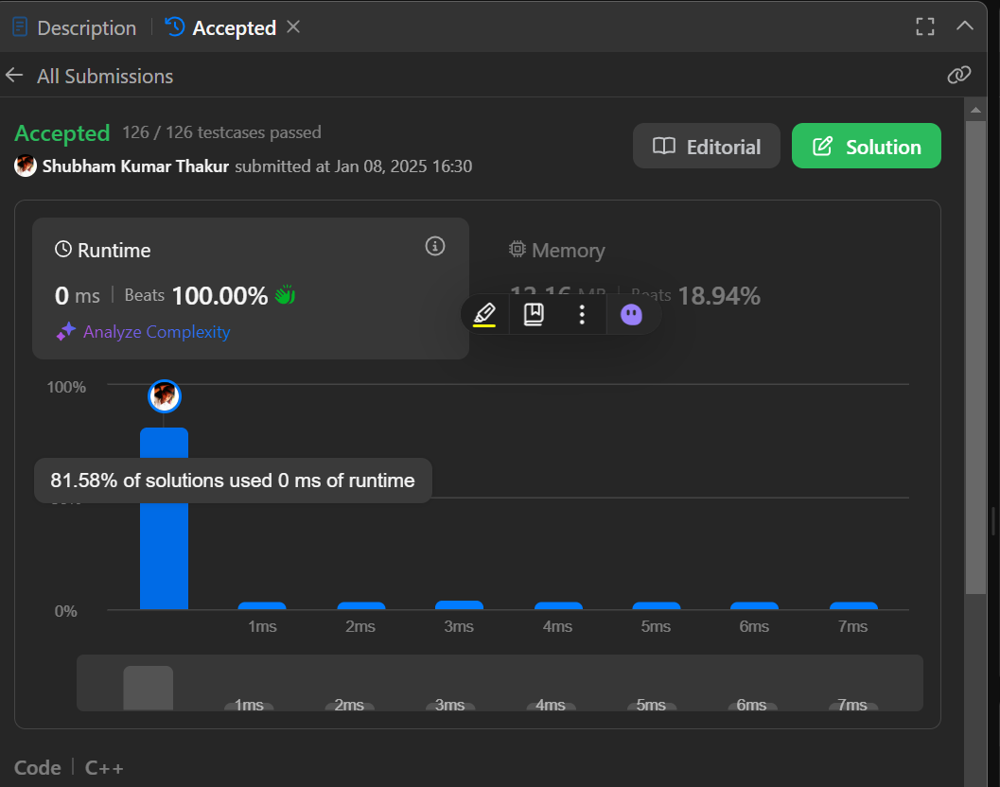

PROBLEM STATEMENT: 
Write a function to find the longest common prefix string amongst an array of strings.  

If there is no common prefix, return an empty string "".  

Approach: 
The function longestCommonPrefix determines the longest common prefix (LCP) for a vector of strings using the following steps: 
 
Edge Case: If the input vector strs is empty, return an empty string. 
Initialization: Assume the first string (strs[0]) is the initial prefix. 
Iterative Check: 
Iterate through the rest of the strings in the vector. 
Compare the prefix with each string, reducing its length character by character until it matches the beginning of the current string. 
If the prefix length becomes zero, return an empty string. 
Return Result: At the end of the iteration, the prefix contains the longest common prefix.   

Time Complexity: 
The algorithm iterates over all strings and compares characters in a way that, in total, does not exceed the number of characters across  all strings. 
Thus, the time complexity is O(m), where m is the total number of characters in all strings. 
Time Complexity: O(m). 
 
 
Space Complexity: 
The algorithm uses constant extra space as no auxiliary data structures are used. 
Thus, the space complexity is O(1). 
Space Complexity: O(1).      

