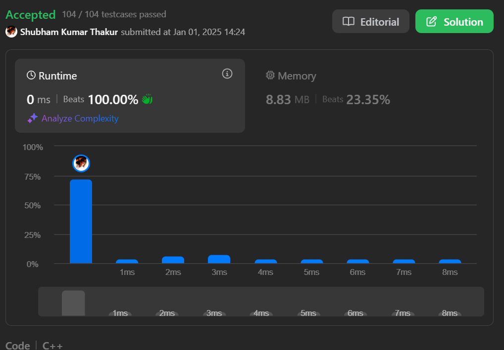

Process:
Initialize left = 0, right = 0, best = INT_MIN.
Traverse the string:
At index 0 ('0'): left = 1, right = 0, best = max(INT_MIN, 1 - 0) = 1.
At index 1 ('1'): left = 1, right = 1, best = max(1, 1 - 1) = 1.
At index 2 ('1'): left = 1, right = 2, best = max(1, 1 - 2) = 1.
At index 3 ('1'): left = 1, right = 3, best = max(1, 1 - 3) = 1.
At index 4 ('0'): left = 2, right = 3, best = max(1, 2 - 3) = 1.
Process the last character ('1'): right = 4.
Final score = best + right = 1 + 4 = 5.

Complexity Analysis
Time Complexity:
O(n): The algorithm traverses the string once to calculate the score for each possible split.

Space Complexity:
O(1): No additional data structures are used; only counters and variables are maintained.

