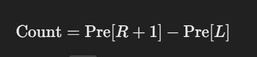

<b>Approach</b>  
The problem is to find the number of words that start and end with vowels within specified ranges of indices in the words array for  multiple queries.  

Preprocessing with Prefix Sum:  

Create a prefix sum array Pre, where Pre[i] represents the count of words that  
start and end with vowels from the start up to the i-thindex. 
For each word, check if the first and last characters are vowels using a set of vowels ({'a', 'e', 'i', 'o', 'u'}). If the condition is  satisfied, increment the prefix sum at that index. 
Answering Queries:  

For each query [L, R], calculate the number of valid words in the range [L, R] using the formula:
 
 

 
Count=Pre[R+1]−Pre[L] 
Store the result for each query in the ANS array. 
       
  
