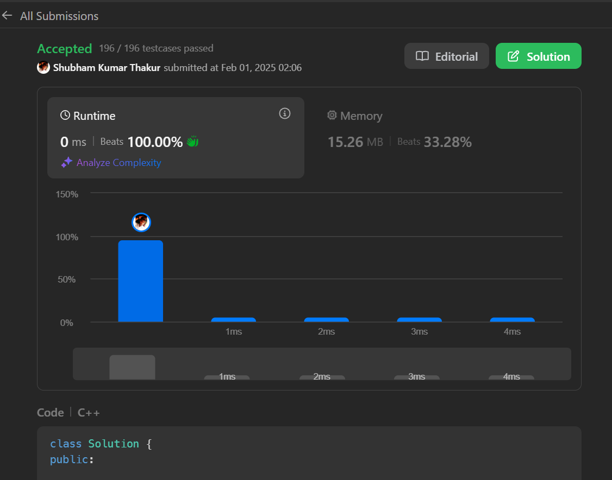

Problem Statement: 
There is an integer array nums sorted in ascending order (with distinct values).  

Prior to being passed to your function, nums is possibly rotated at an unknown pivot index k (1 <= k < nums.length) such that the  resulting array is [nums[k], nums[k+1], ..., nums[n-1], nums[0], nums[1], ..., nums[k-1]] (0-indexed). For example, [0,1,2,4,5,6,7]  might be rotated at pivot index 3 and become [4,5,6,7,0,1,2].  

Given the array nums after the possible rotation and an integer target, return the index of target if it is in nums, or -1 if it is not  in nums.  

You must write an algorithm with O(log n) runtime complexity.   

Approach 
Finding the Pivot Index:  

The function findPivotIndex uses a modified binary search to find the pivot index in a rotated sorted array. 
The pivot is the point where the array was rotated, and it is the largest element in the array. 
The algorithm checks: 
If the middle element is greater than the next element, the middle is the pivot. 
If the middle element is less than the previous element, the previous element is the pivot. 
Depending on the relationship between the start, mid, and end elements, it narrows down the search space. 
Binary Search: 
 
The binarySearch function performs a standard binary search on the identified segments of the array. 
It checks if the target is equal to the middle element, and if not, it adjusts the search range based on whether the target is greater  or less than the middle element. 
Searching for the Target:  

The search function first finds the pivot index using findPivotIndex. 
It then determines which segment of the array to search based on the target's value relative to the elements at the pivot and the start  of the array. 
Finally, it calls binarySearch on the appropriate segment to find the target. 
 
Complexity: 
Time Complexity 
Finding the Pivot: O(log n) - The pivot is found using binary search. 
Binary Search: O(log n) - The binary search also runs in logarithmic time. 
Overall: O(log n) for the entire search process since both operations are logarithmic and sequential. 
 
 
Space Complexity 
Space Complexity: O(1) - The algorithm uses a constant amount of extra space (only a few integer variables) regardless of the input  size. The input array is modified in place, and no additional data structures are used.           

