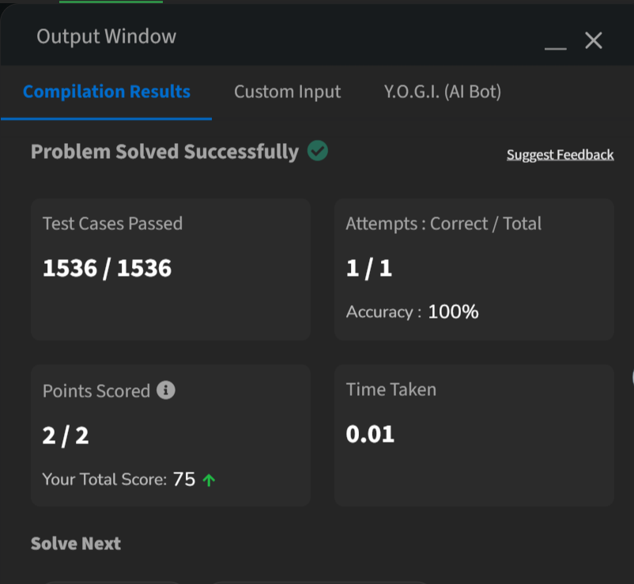

Fibonacci Expression  

Given a number N, evaluate the following  expression.  
f(n-1)*f(n+1) - f(n)*f(n) where f(n) is the  n-th Fibonacci number with n >= 1. 
Fibonacci Sequence is 0, 1, 1, 2, 3, 5, 8, 13,…  (here 0 is the 0th Fibonacci number)   
Approach: 
Expression Simplification: Using the Fibonacci identity: 

f(N−1)⋅f(N+1)−f(N)⋅f(N)=(−1) 
N 
 
This identity holds for all  
N≥1. 
 
The code leverages this property without  explicitly calculating the Fibonacci numbers.

Code Logic: 
f(n+1)*f(n-1) - f(n)*f(n)

<b>Time and Space Complexity:</b>  
Time Complexity:  

The code executes a single modulus operation  and a conditional check, both  

O(1). 
Overall Time Complexity:  
O(1).
  
Space Complexity:  

No additional data structures or significant  memory allocations are used. 
Overall Space Complexity:  
𝑂(1).     

