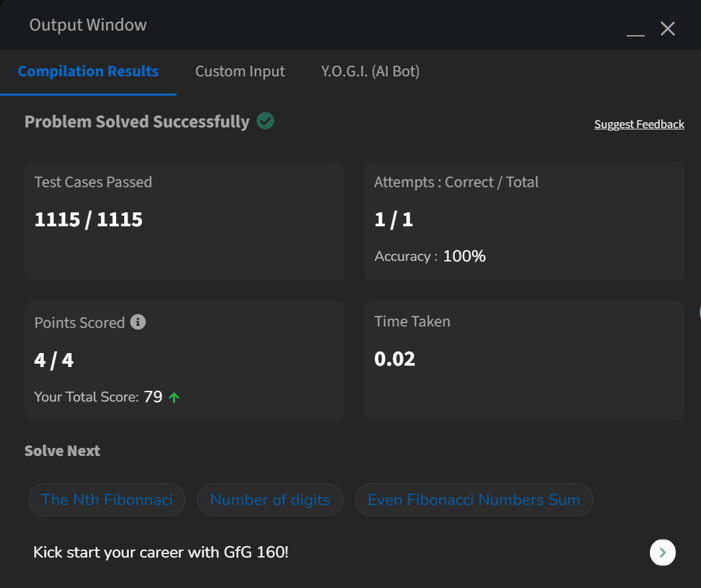

Problem Statement: 
Given a number positive number N, find the value of f0 + f1 + f2 +... + fN where fi indicates ith Fibonacci number. 
Remember that f0 = 0, f1 = 1, f2 = 1, f3 = 2, f4 = 3, f5 = 5, 
Since the answer can be very large, the answer takes modulo with 1000000007 and returned. 
  

Optimized Alternative: 
If space efficiency is critical, the dp array can be replaced by two variables (prev1 and prev2) to store the last two Fibonacci  numbers, reducing space complexity to O(1). 

Time Complexity: 
Calculating Fibonacci numbers and their sum in a single loop requires  
O(N) operations. 
Overall Time Complexity: O(N).  
Space Complexity: 
The dp array of size N+1 is used to store Fibonacci numbers.  
Overall Space Complexity: O(N). 
     
