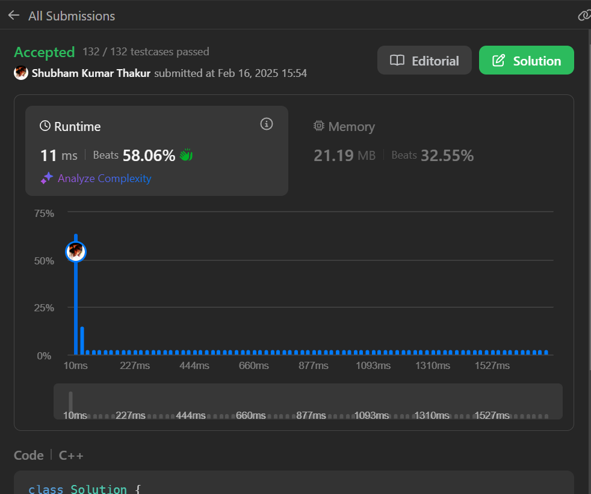

Problem statement: 
Given a string s, return the number of palindromic substrings in it. 
A string is a palindrome when it reads the same backward as forward. 
A substring is a contiguous sequence of characters within the string.  

Approach: 
The given code is designed to count the number of palindromic substrings in a given string s. It uses the  concept of expanding around a center to find palindromes. Here's a breakdown of the approach: 
 
Expansion Method:  

The helper function expand(s, i, j) checks how far the string can expand while maintaining a palindrome. 
Starting with a given center (i, j), it compares the characters at i and j, and if they are the same, it  expands outward (decreasing i and increasing j), counting how many palindromic substrings exist centered  at that index. 
This function returns the count of palindromes that can be expanded around the given center. 
Main Method (countSubstrings):  

The function countSubstrings iterates through every possible center in the string. 
For odd-length palindromes, it calls expand(s, center, center) where center is the midpoint. 
For even-length palindromes, it calls expand(s, center, center + 1) where the center is between two  characters. 
For each center, it accumulates the total count of palindromic substrings. 
Time Complexity: 
Outer Loop:  

The loop runs for every index in the string, so it will execute n times, where n is the length of the  string s. 
Expand Function:  

For each index center, the expand function tries to expand both for odd and even length centers. 
In the worst case, the expand function might check all the way out to the edges of the string (which  happens in the case of a palindrome spanning the whole string). 
Hence, for each center, the expand function could take O(n) time in the worst case. 
Total Time Complexity:  

Since we are calling expand for each center twice (once for odd and once for even), the total time  complexity is O(n) for the loop, and O(n) for the expand function call for each loop iteration. 
Therefore, the overall time complexity is O(n^2). 
Space Complexity: 
The space complexity is determined by the amount of extra space used in the solution. 
The algorithm only uses a few integer variables (count, totalCount, center), so the space used is constant,  i.e., O(1). 
There is no extra data structure (like an array or hash map) used that grows with the size of the input  string.           

